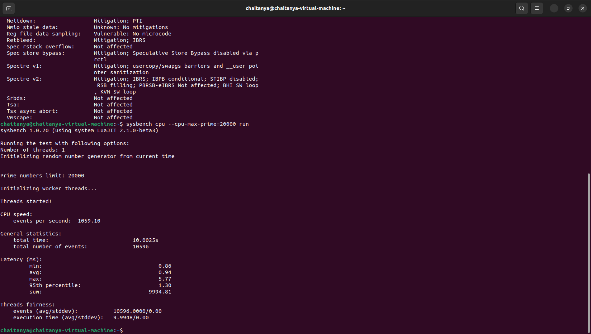
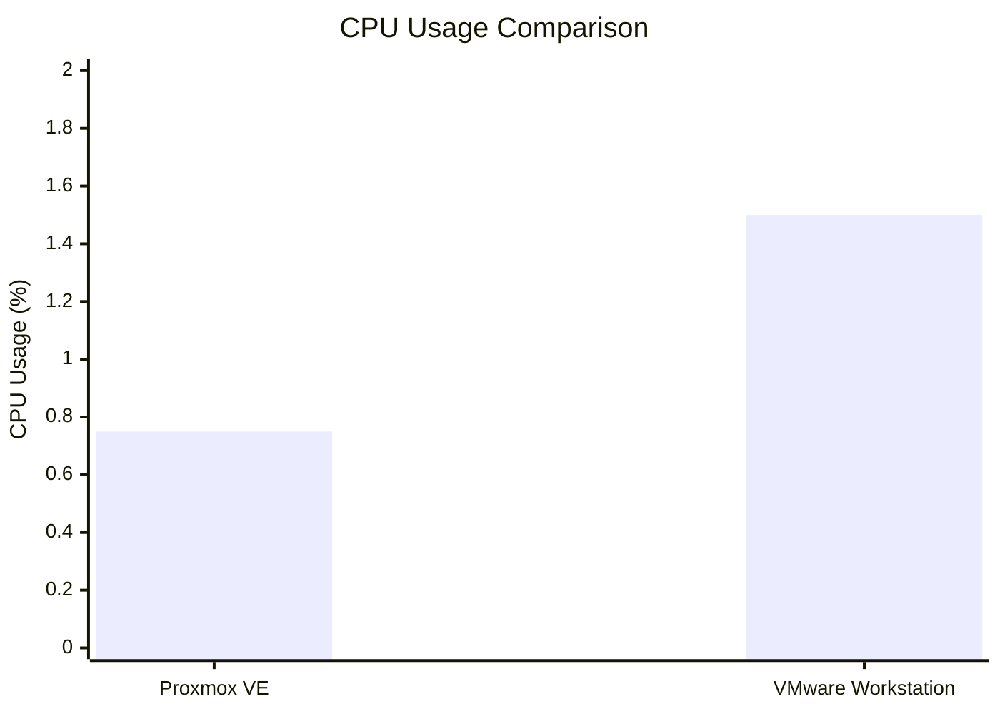
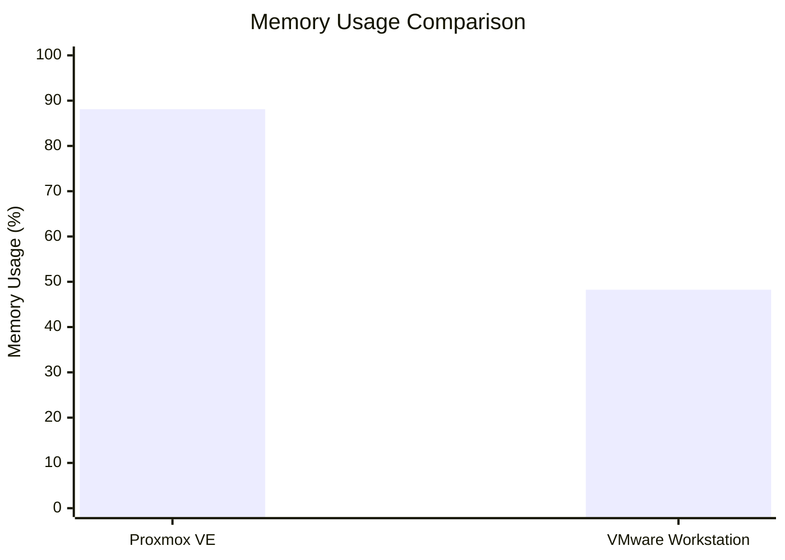
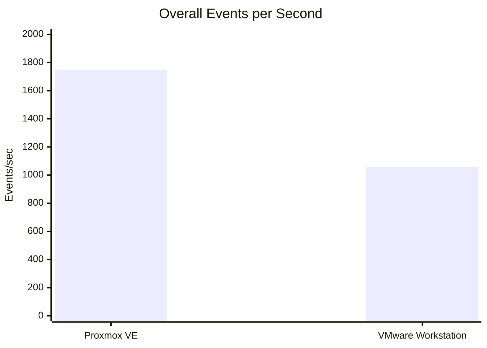

# CC-Experiment-01: Hypervisor Analysis

## Performance Analysis of Type-1 and Type-2 Hypervisors

This experiment compares two virtualization approaches:

* **Type-1 Hypervisor:** Proxmox VE
* **Type-2 Hypervisor:** VMware Workstation

Both hypervisors were used to run an Ubuntu virtual machine. Their CPU performance and resource utilization were observed and compared using benchmarking tools and experimental results.

---

## 1. Objectives

The objectives of this experiment are:

* To understand Type-1 and Type-2 hypervisors.
* To configure and run an Ubuntu virtual machine using Proxmox VE.
* To configure and run an Ubuntu virtual machine using VMware Workstation.
* To perform CPU benchmarking using Sysbench.
* To monitor resource utilization.
* To compare the performance of both virtualization approaches.

---

## 2. Hypervisor Types

### 2.1 Type-1 Hypervisor – Proxmox VE

Proxmox VE is a **Type-1 bare-metal hypervisor** that runs directly on the physical hardware.

It provides:

* Direct access to hardware resources
* Virtual machine management
* Resource allocation and monitoring
* Web-based administration
* Support for server and data-center virtualization

### 2.2 Type-2 Hypervisor – VMware Workstation

VMware Workstation is a **Type-2 hosted hypervisor** that runs on top of a host operating system.

It provides:

* Easy virtual machine creation
* Desktop-based VM management
* Support for multiple guest operating systems
* A convenient environment for development and testing

---

## 3. Experimental Setup

| Parameter       | Proxmox VE   | VMware Workstation |
| --------------- | ------------ | ------------------ |
| Hypervisor Type | Type-1       | Type-2             |
| Guest OS        | Ubuntu       | Ubuntu             |
| CPU Allocation  | 2 vCPU       | 2 vCPU             |
| RAM             | 2 GB         | 2 GB               |
| Storage         | 20 GB        | 20 GB              |
| Benchmark       | Sysbench CPU | Sysbench CPU       |

---

## 4. Experimental Procedure

### 4.1 Proxmox VE

1. Installed and configured Proxmox VE.
2. Created an Ubuntu virtual machine.
3. Allocated CPU, RAM and storage.
4. Started the virtual machine.
5. Installed Sysbench.
6. Executed the CPU benchmark.
7. Recorded the benchmark results.
8. Monitored system resource utilization.

### 4.2 VMware Workstation

1. Installed VMware Workstation.
2. Created an Ubuntu virtual machine.
3. Allocated CPU, RAM and storage.
4. Started the virtual machine.
5. Installed Sysbench.
6. Executed the CPU benchmark.
7. Recorded the benchmark results.
8. Compared the results with Proxmox VE.

---

## 5. Benchmarking

CPU performance was evaluated using **Sysbench**.

The following command was used:

```bash
sysbench cpu --cpu-max-prime=20000 run
```

The benchmark results obtained from both virtual machines were used for comparison.

---

## 6. Experimental Screenshots

Only **one representative screenshot from each hypervisor** is included in this README.

### 6.1 Proxmox VE – Sysbench Result


### 6.2 VMware Workstation – Sysbench Result



---

# 7. Performance Comparison

The following graphs provide a visual comparison of the experimental results obtained from Proxmox VE and VMware Workstation.

## 7.1 CPU Usage Graph



## 7.2 Memory Usage Graph



### Overall Performance Gra

## 8. Detailed Performance Analysis

The complete numerical results, observations and experimental analysis are available in:




The performance analysis contains the detailed benchmark results and resource utilization observations.

---

## 9. Type-1 vs Type-2 Comparison

| Feature         | Proxmox VE                | VMware Workstation      |
| --------------- | ------------------------- | ----------------------- |
| Hypervisor Type | Type-1                    | Type-2                  |
| Runs On         | Physical hardware         | Host operating system   |
| Hardware Access | Direct                    | Through host OS         |
| Primary Usage   | Server / Data Center      | Desktop / Development   |
| Management      | Web-based                 | Desktop application     |
| Typical Use     | Production virtualization | Testing and development |

---

## 10. Key Observations

* Proxmox VE operates directly on physical hardware as a Type-1 hypervisor.
* VMware Workstation operates above the host operating system as a Type-2 hypervisor.
* Both environments successfully ran the Ubuntu guest operating system.
* Sysbench was used to evaluate CPU performance.
* Resource utilization was monitored during the experiment.
* Comparison graphs provide a visual representation of the measured results.
* Detailed numerical results and observations are documented in the performance analysis file.

---

## 11. Repository Structure

```text
CC-Experiment-01-Hypervisor-Analysis/
│
├── screenshots/
│   │
│   ├── type1-proxmox/
│   │   ├── 01-proxmox-dashboard.png
│   │   ├── 02-proxmox-vm-configuration.png
│   │   ├── 03-proxmox-vm-running.png
│   │   ├── 04-proxmox-ubuntu-console.png
│   │   ├── 05-proxmox-system-configuration.png
│   │   ├── 06-proxmox-sysbench-result.png
│   │   └── 07-proxmox-resource-monitoring.png
│   │
│   ├── type2-vmware/
│   │   ├── 01-vmware-vm-configuration.png
│   │   ├── 02-vmware-vm-running.png
│   │   ├── 03-vmware-system-configuration.png
│   │   └── 04-vmware-sysbench-result.png
│   │
│   └── comparison/
│       ├── 01-hypervisor-performance-comparison.png
│       ├── 02-resource-utilization-comparison.png
│       └── 03-performance-analysis-comparison.png
│
├── results/
│   └── performance-analysis.md
│
└── README.md
```

---

## 12. Conclusion

This experiment provided practical experience with both Type-1 and Type-2 virtualization.

Proxmox VE was studied as a bare-metal hypervisor, while VMware Workstation was studied as a hosted hypervisor. Ubuntu virtual machines were configured in both environments and evaluated using Sysbench.

The benchmark results, resource utilization observations and comparison graphs provide a practical understanding of the differences between Type-1 and Type-2 virtualization.
