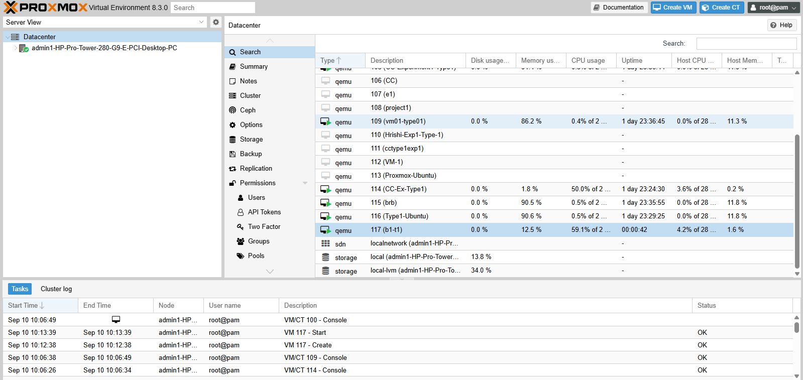
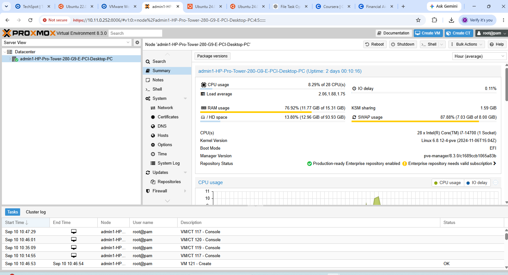
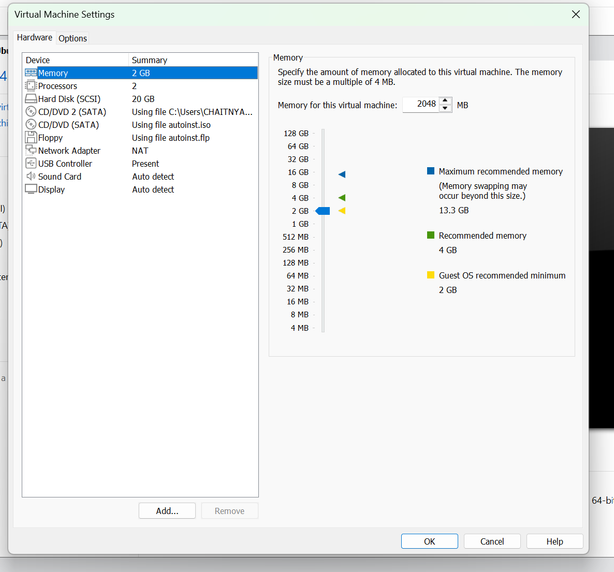
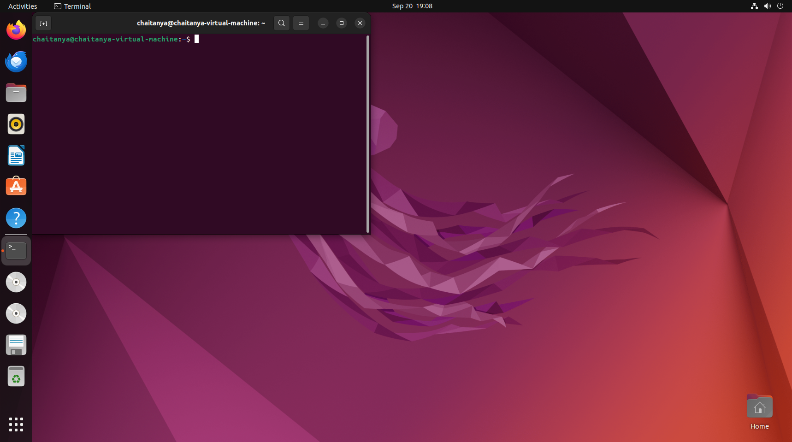
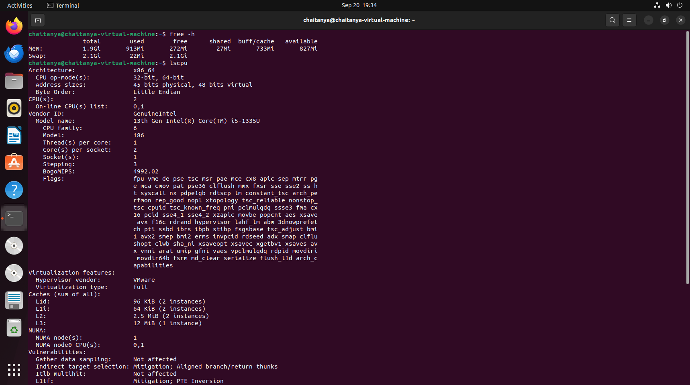
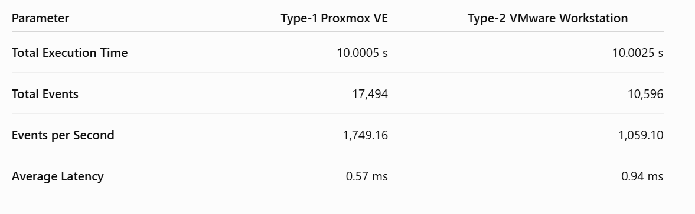

# CC-Experiment-01: Hypervisor Analysis

## Performance Analysis of Type-1 and Type-2 Hypervisors

---

## 1. Introduction

This experiment focuses on understanding and analyzing virtualization using two different types of hypervisors:

* **Type-1 Hypervisor:** Proxmox VE
* **Type-2 Hypervisor:** VMware Workstation

Ubuntu Virtual Machines were deployed in both environments and their configurations, system resources, CPU performance, and resource utilization were observed.

The **Sysbench CPU benchmark** was used to measure and compare the performance of the two virtualization approaches.

The experiment also includes graphical comparison of the obtained results.

---

## 2. Objectives

The objectives of this experiment are:

1. To understand Type-1 and Type-2 hypervisor architectures.
2. To deploy an Ubuntu Virtual Machine using Proxmox VE.
3. To deploy an Ubuntu Virtual Machine using VMware Workstation.
4. To configure comparable resources for both virtual machines.
5. To observe CPU, memory, storage, and system configurations.
6. To perform CPU benchmarking using Sysbench.
7. To monitor resource utilization.
8. To compare the performance of Type-1 and Type-2 hypervisors.
9. To represent the experimental results using graphs.
10. To analyze the advantages and limitations of both virtualization approaches.

---

# 3. Hypervisor Architecture

## 3.1 Type-1 Hypervisor – Proxmox VE

Proxmox VE is a **Type-1 (bare-metal) hypervisor platform**.

It operates directly on the physical hardware and provides virtualization facilities for running virtual machines.

### Architecture

```text
+--------------------------------------+
|        Ubuntu Virtual Machine        |
|       Sysbench CPU Benchmark         |
+--------------------------------------+
|          Proxmox VE / KVM            |
|          Type-1 Hypervisor           |
+--------------------------------------+
|          Physical Hardware           |
|       CPU | RAM | Storage | NIC      |
+--------------------------------------+
```

The virtualization layer is placed directly above the physical hardware.

---

## 3.2 Type-2 Hypervisor – VMware Workstation

VMware Workstation is a **Type-2 (hosted) hypervisor**.

It runs as an application on top of a host operating system and provides virtualization for guest operating systems.

### Architecture

```text
+--------------------------------------+
|        Ubuntu Virtual Machine        |
|       Sysbench CPU Benchmark         |
+--------------------------------------+
|        VMware Workstation            |
|          Type-2 Hypervisor           |
+--------------------------------------+
|        Host Operating System         |
|              Windows                 |
+--------------------------------------+
|          Physical Hardware           |
|       CPU | RAM | Storage | NIC      |
+--------------------------------------+
```

In this architecture, the host operating system exists between the physical hardware and the virtualization software.

---

# 4. Experimental Setup

Comparable virtual machine configurations were used for both environments.

| Parameter       | Proxmox VE   | VMware Workstation |
| --------------- | ------------ | ------------------ |
| Hypervisor Type | Type-1       | Type-2             |
| Guest OS        | Ubuntu       | Ubuntu             |
| CPU Allocation  | 2 vCPU       | 2 vCPU             |
| RAM             | 2 GB         | 2 GB               |
| Disk            | 20 GB        | 20 GB              |
| Benchmark       | Sysbench CPU | Sysbench CPU       |

Using similar VM configurations helps make the comparison more meaningful.

---

# 5. Type-1 Hypervisor – Proxmox VE

## 5.1 Proxmox Dashboard

The Proxmox dashboard was used to manage the virtual machine and monitor the virtualization environment.


---

## 5.2 Proxmox VM Configuration

The Ubuntu virtual machine was configured with the required CPU, memory, and storage resources.


---

## 5.3 Proxmox VM Running

The Ubuntu virtual machine was successfully started and operated inside the Proxmox environment.



---

## 5.4 Ubuntu Console

The Ubuntu console was accessed inside the Proxmox virtual machine for executing system and benchmarking commands.


---

## 5.5 System Configuration

The CPU, memory, operating system, and other system details of the Ubuntu virtual machine were verified.


---

## 5.6 Sysbench CPU Benchmark

The Sysbench CPU benchmark was executed inside the Ubuntu virtual machine.

A CPU benchmark command such as the following was used:

```bash
sysbench cpu --cpu-max-prime=20000 run
```

The resulting benchmark output was recorded.


---

## 5.7 Proxmox Resource Monitoring

Resource utilization was monitored while the virtual machine was running.

The monitoring includes information related to CPU and memory usage.



---

# 6. Type-2 Hypervisor – VMware Workstation

## 6.1 VMware VM Configuration

An Ubuntu virtual machine was configured inside VMware Workstation with comparable resources.



---

## 6.2 VMware VM Running

The Ubuntu virtual machine was successfully started using VMware Workstation.



---

## 6.3 VMware System Configuration

The system configuration of the Ubuntu guest operating system was verified.



---

## 6.4 VMware Sysbench CPU Benchmark

The same Sysbench CPU benchmark was executed inside the VMware Ubuntu virtual machine.


---

# 7. Benchmarking Methodology

## 7.1 Sysbench CPU Benchmark

Sysbench was used to measure CPU performance inside both virtual machines.

The benchmark performs computational operations and provides measurements such as:

* Total execution time
* Number of events
* Events per second
* Minimum latency
* Average latency
* Maximum latency
* 95th percentile latency

The same benchmark workload was used for both virtualization environments.

### Benchmark Command

```bash
sysbench cpu --cpu-max-prime=20000 run
```

Using the same workload helps provide a consistent basis for comparison.

---

# 8. Performance Results

The detailed performance results and analysis are available in:

**[View Detailed Performance Analysis](results/performance-analysis.md)**

The performance analysis includes the measured benchmark values and comparison of the two hypervisor environments.

---

# 9. Graphical Analysis

The experimental results were also represented graphically to make the comparison easier to understand.

## 9.1 Overall Hypervisor Performance Comparison

The following graph presents the overall performance comparison between Proxmox VE and VMware Workstation based on the experimental results.



---

# 10. Performance Comparison

The following parameters were considered during the experiment:

| Parameter               | Proxmox VE | VMware Workstation |
| ----------------------- | ---------- | ------------------ |
| Hypervisor Architecture | Type-1     | Type-2             |
| Guest Operating System  | Ubuntu     | Ubuntu             |
| CPU Allocation          | 2 vCPU     | 2 vCPU             |
| Memory Allocation       | 2 GB       | 2 GB               |
| Storage Allocation      | 20 GB      | 20 GB              |
| CPU Benchmark           | Sysbench   | Sysbench           |
| Resource Monitoring     | Performed  | Observed           |
| Performance Graph       | Included   | Included           |

The exact measured benchmark values are documented in the performance analysis file.

---

# 11. Resource Utilization

Resource utilization is an important factor in evaluating virtualization performance.

The experiment considered:

* CPU utilization
* Memory utilization
* Virtual machine resource consumption
* System load during benchmarking

The Proxmox resource monitoring result is shown below.


Resource utilization can vary depending on the host machine, background processes, VM configuration, workload, and virtualization settings.

---

# 12. Type-1 vs Type-2 Hypervisor Comparison

| Feature             | Proxmox VE                               | VMware Workstation              |
| ------------------- | ---------------------------------------- | ------------------------------- |
| Hypervisor Type     | Type-1                                   | Type-2                          |
| Architecture        | Bare-metal                               | Hosted                          |
| Host OS Layer       | No separate desktop OS layer             | Uses host OS                    |
| Main Use            | Server and infrastructure virtualization | Desktop virtualization          |
| Management          | Web-based interface                      | Desktop application             |
| Resource Management | Direct virtualization layer              | Through host OS and hypervisor  |
| VM Support          | Multiple VMs                             | Multiple VMs                    |
| Suitable For        | Servers, labs, infrastructure            | Development, testing, education |

---

# 13. Advantages and Limitations

## 13.1 Proxmox VE

### Advantages

* Type-1 bare-metal virtualization.
* Direct access to physical hardware through the virtualization layer.
* Web-based management interface.
* Suitable for server and infrastructure virtualization.
* Supports multiple virtual machines.
* Provides centralized virtual machine management.

### Limitations

* Typically requires dedicated hardware for a bare-metal deployment.
* Initial configuration may be more complex for beginners.
* Hardware compatibility needs to be considered.

---

## 13.2 VMware Workstation

### Advantages

* Easy to install on a desktop operating system.
* User-friendly graphical interface.
* Useful for development and testing.
* Allows multiple operating systems to run on a single computer.
* Suitable for educational virtualization experiments.

### Limitations

* Requires a host operating system.
* Shares host resources with other applications.
* Additional virtualization layers can introduce overhead.
* Performance can be affected by host background processes.

---

# 14. Key Observations

The following observations were made during the experiment:

1. Ubuntu was successfully deployed in both virtualization environments.
2. Comparable CPU, memory, and storage configurations were used.
3. Sysbench was successfully used to benchmark CPU performance.
4. Proxmox VE demonstrated the characteristics of a Type-1 hypervisor.
5. VMware Workstation demonstrated the characteristics of a Type-2 hypervisor.
6. Resource utilization was monitored during virtual machine execution.
7. Benchmark results were represented using a comparison graph.
8. The virtualization architecture can influence resource utilization and benchmark performance.
9. Host-system activity and VM configuration can also affect measured results.
10. The experiment provided practical understanding of virtualization performance analysis.

---

# 15. Factors Affecting Virtual Machine Performance

The performance observed during virtualization can depend on several factors:

* Physical CPU performance
* Number of allocated virtual CPUs
* RAM allocation
* Storage performance
* Host operating system
* Hypervisor architecture
* Background applications
* CPU scheduling
* Virtual disk configuration
* Virtualization technology
* System workload during benchmarking

Therefore, benchmark results should be interpreted within the context of the experimental setup.

---

# 16. Conclusion

This experiment provided practical knowledge of virtualization and the differences between Type-1 and Type-2 hypervisors.

**Proxmox VE** was used as the Type-1 hypervisor, while **VMware Workstation** was used as the Type-2 hypervisor. Ubuntu virtual machines were deployed in both environments with comparable configurations.

The **Sysbench CPU benchmark** was used to measure CPU performance, while resource monitoring was used to observe system resource utilization.

The experimental results were documented using screenshots and represented using a performance comparison graph.

Overall, the experiment demonstrated how hypervisor architecture, resource allocation, host operating-system overhead, and system workload can influence the performance of virtual machines.

---

# 17. Repository Structure

```text
CC-Experiment-01-Hypervisor-Analysis/
│
├── screenshots/
│   │
│   ├── type1-proxmox/
│   │   ├── 01-proxmox-dashboard.png
│   │   ├── 02-proxmox-vm-configuration.png
│   │   ├── 03-proxmox-vm-running.png
│   │   ├── 04-proxmox-ubuntu-console.png
│   │   ├── 05-proxmox-system-configuration.png
│   │   ├── 06-proxmox-sysbench-result.png
│   │   └── 07-proxmox-resource-monitoring.png
│   │
│   ├── type2-vmware/
│   │   ├── 01-vmware-vm-configuration.png
│   │   ├── 02-vmware-vm-running.png
│   │   ├── 03-vmware-system-configuration.png
│   │   └── 04-vmware-sysbench-result.png
│   │
│   └── comparison/
│       └── 01-hypervisor-performance-comparison.png
│
├── results/
│   └── performance-analysis.md
│
└── README.md
```

---

# 18. Experiment Deliverables

| Deliverable                   | Location                          |
| ----------------------------- | --------------------------------- |
| Proxmox Screenshots           | `screenshots/type1-proxmox/`      |
| VMware Screenshots            | `screenshots/type2-vmware/`       |
| Performance Comparison Graph  | `screenshots/comparison/`         |
| Detailed Performance Analysis | `results/performance-analysis.md` |
| Complete Experiment README    | `README.md`                       |

---

# 19. Summary

| Component           | Used In Experiment       |
| ------------------- | ------------------------ |
| Type-1 Hypervisor   | Proxmox VE               |
| Type-2 Hypervisor   | VMware Workstation       |
| Guest OS            | Ubuntu                   |
| Benchmark Tool      | Sysbench                 |
| CPU Benchmark       | Sysbench CPU             |
| Resource Monitoring | Proxmox / VM environment |
| Comparison          | Performance metrics      |
| Graphical Analysis  | PNG comparison graph     |
| Documentation       | Markdown                 |

---

## 20. Final Result

The experiment successfully demonstrated and compared two virtualization approaches:

**Type-1:** Proxmox VE
**Type-2:** VMware Workstation

The repository contains the complete experimental screenshots, benchmark results, resource monitoring evidence, graphical comparison, and detailed performance analysis.

---

**CC Experiment 01 – Hypervisor Analysis**
**Cloud Computing**
