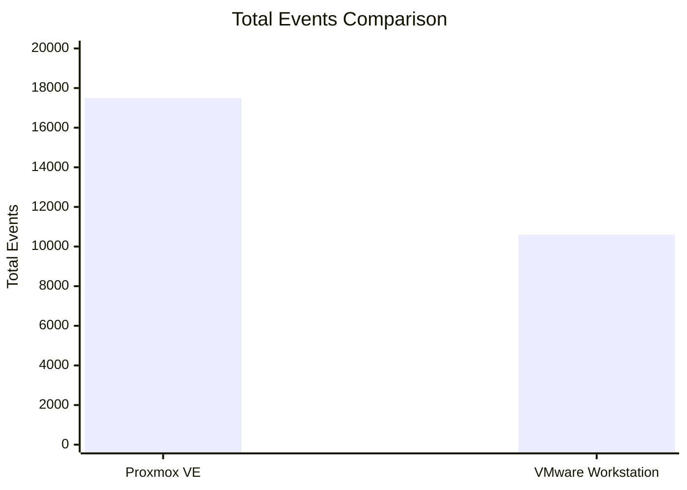
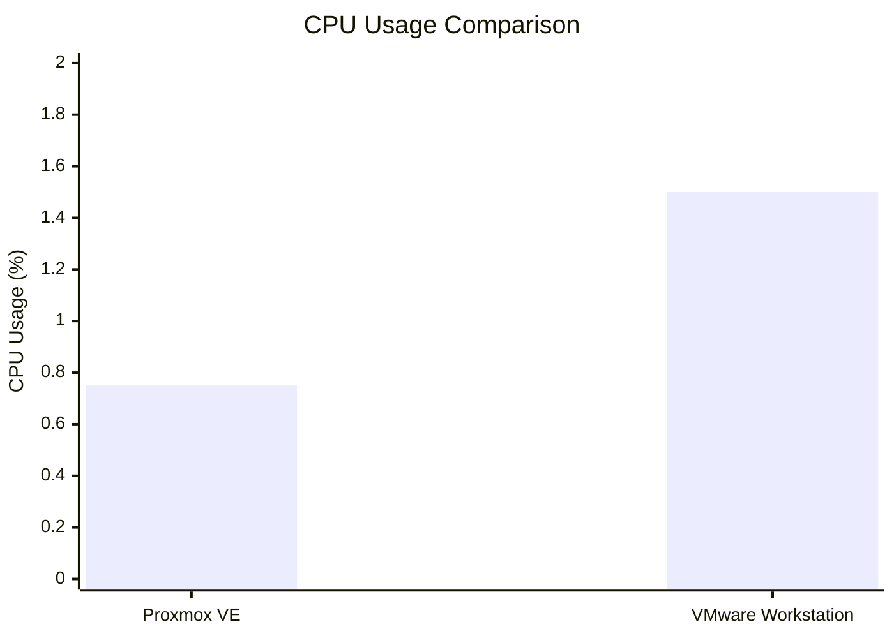
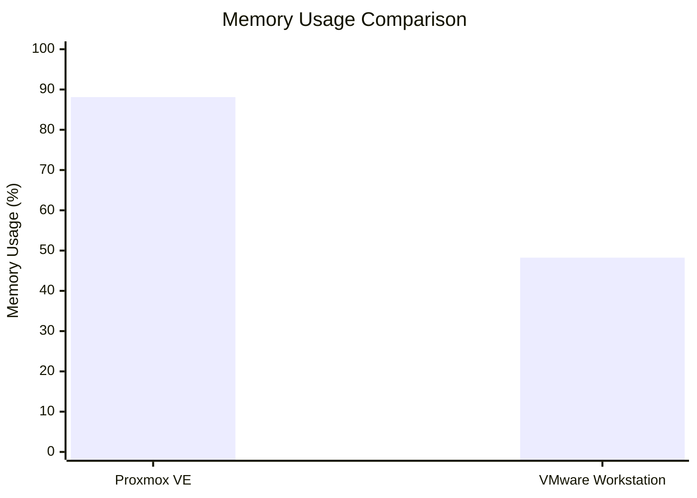
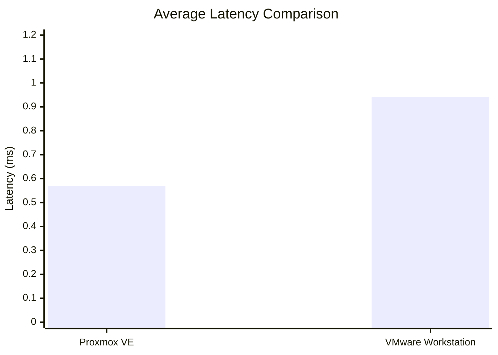
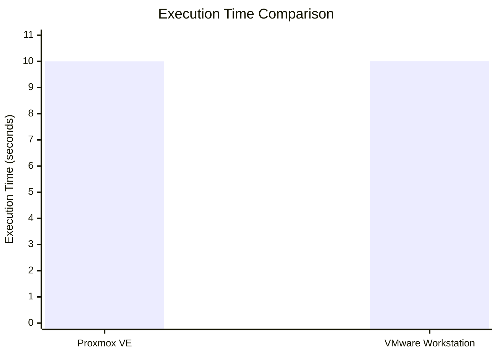
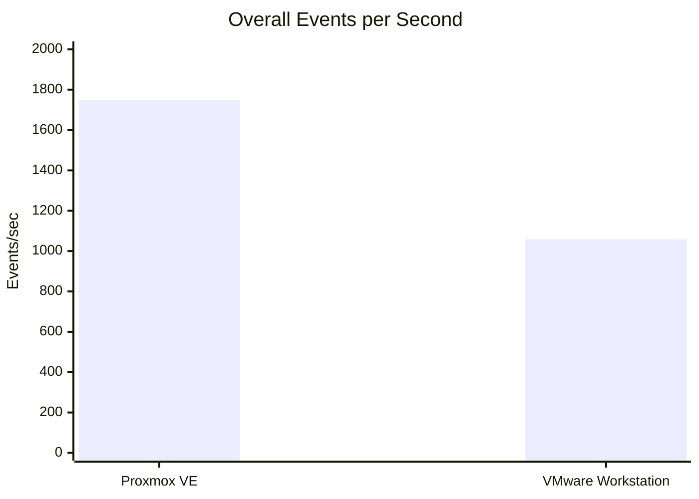

# Overall Performance Analysis

## 1. Introduction

This experiment compares the performance of two virtualization approaches:

- **Type-1 Hypervisor:** Proxmox VE
- **Type-2 Hypervisor:** VMware Workstation

---

## 2. Type-1 Hypervisor – Proxmox VE

### 2.1 System Configuration

| Parameter | Proxmox VE |
|---|---|
| Hypervisor Type | Type-1 |
| Guest OS | Ubuntu |
| CPU Cores | 2 vCPU |
| RAM | 2 GB |
| Storage | 20 GB |

### 2.2 Sysbench CPU Result

| Parameter | Result |
|---|---:|
| Events per Second | **1,749.16 events/sec** |
| Total Events | **17,494** |
| Execution Time | **10.0005 s** |
| Average Latency | **0.57 ms** |

### 2.3 Resource Monitoring

- **CPU Usage:** 0.75%
- **Memory Usage:** 88.12% (1.76 GiB / 2.00 GiB)

---

## 3. Type-2 Hypervisor – VMware Workstation

### 3.1 System Configuration

| Parameter | VMware Workstation |
|---|---|
| Hypervisor Type | Type-2 |
| Guest OS | Ubuntu |
| CPU Cores | 2 vCPU |
| RAM | 2 GB |
| Storage | 20 GB |

### 3.2 Sysbench CPU Result

| Parameter | Result |
|---|---:|
| Events per Second | **1,059.10 events/sec** |
| Total Events | **10,596** |
| Execution Time | **10.0025 s** |
| Average Latency | **0.94 ms** |

### 3.3 Resource Monitoring

- **CPU Usage:** 1.5%
- **Memory Usage:** 48.25%

---

# 4. Performance Comparison

## 4.1 CPU Performance

| Parameter | Type-1: Proxmox VE | Type-2: VMware Workstation |
|---|---:|---:|
| Total Events | **17,494** | **10,596** |
| Events per Second | **1,749.16** | **1,059.10** |
| Average Latency | **0.57 ms** | **0.94 ms** |
| Execution Time | **10.0005 s** | **10.0025 s** |

### CPU Performance Graph

### Total Events Graph

### Observation

The Sysbench CPU benchmark recorded:

- Proxmox VE: **1,749.16 events/sec**
- VMware Workstation: **1,059.10 events/sec**

The measured average latency was:

- Proxmox VE: **0.57 ms**
- VMware Workstation: **0.94 ms**

The execution times were very close:

- Proxmox VE: **10.0005 s**
- VMware Workstation: **10.0025 s**

---

# 5. Resource Usage Comparison

| Resource | Proxmox VE | VMware Workstation |
|---|---:|---:|
| CPU Usage | **0.75%** | **1.5%** |
| Memory Usage | **88.12%** | **48.25%** |

## 5.1 CPU Usage Graph

## 5.2 Memory Usage Graph

### Resource Usage Observation

The recorded CPU usage was:

- Proxmox VE: **0.75%**
- VMware Workstation: **1.5%**

The recorded memory usage was:

- Proxmox VE: **88.12%**
- VMware Workstation: **48.25%**

These measurements represent the resource utilization captured during the monitoring period.

---

# 6. Latency and Execution Time Comparison

## 6.1 Average Latency

## 6.2 Execution Time

### Observation

The average latency measured during the Sysbench benchmark was:

- Proxmox VE: **0.57 ms**
- VMware Workstation: **0.94 ms**

The execution times were:

- Proxmox VE: **10.0005 seconds**
- VMware Workstation: **10.0025 seconds**

The execution times were therefore very close in this experiment.

---

# 7. Overall Comparison

| Metric | Proxmox VE | VMware Workstation |
|---|---:|---:|
| Hypervisor Type | Type-1 | Type-2 |
| Total Events | **17,494** | **10,596** |
| Events/sec | **1,749.16** | **1,059.10** |
| Average Latency | **0.57 ms** | **0.94 ms** |
| Execution Time | **10.0005 s** | **10.0025 s** |
| CPU Usage | **0.75%** | **1.5%** |
| Memory Usage | **88.12%** | **48.25%** |

### Overall Performance Graph

---

# 8. Overall Observation

The experiment was conducted using Ubuntu guest operating systems with the same virtual machine resources:

- **2 vCPU**
- **2 GB RAM**
- **20 GB storage**

The measured Sysbench CPU results were:

- **Proxmox VE:** 17,494 total events and 1,749.16 events/sec
- **VMware Workstation:** 10,596 total events and 1,059.10 events/sec

The measured average latency was:

- **Proxmox VE:** 0.57 ms
- **VMware Workstation:** 0.94 ms

The execution time was approximately 10 seconds for both benchmark runs.

The Proxmox VM resource monitoring showed **0.75% CPU usage** and **88.12% memory usage (1.76 GiB / 2.00 GiB)**, whereas VMware Workstation showed **1.5% CPU usage** and **48.25% memory usage** at the time of the captured monitoring result.

---

# 9. Conclusion

The experiment provided a practical comparison between a Type-1 hypervisor, Proxmox VE, and a Type-2 hypervisor, VMware Workstation.

Based on the recorded Sysbench CPU benchmark:

- Proxmox VE recorded **1,749.16 events/sec**.
- VMware Workstation recorded **1,059.10 events/sec**.
- Proxmox VE recorded an average latency of **0.57 ms**.
- VMware Workstation recorded an average latency of **0.94 ms**.
- Both executions completed in approximately **10 seconds**.

The resource monitoring measurements also showed differences in CPU and memory utilization between the two virtualization environments.

Overall, the experiment demonstrates how virtualization architecture can be compared using measurable parameters such as **CPU benchmark performance, latency, execution time, CPU utilization, and memory utilization**.
